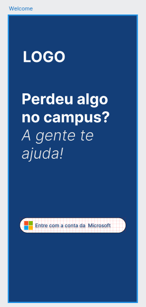
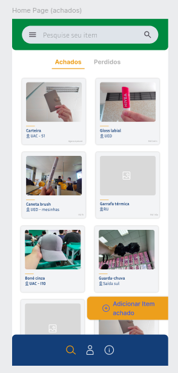
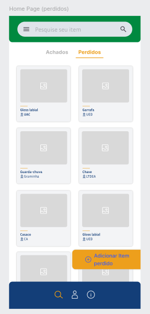
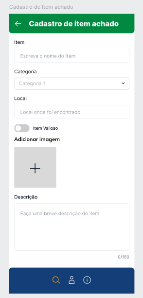
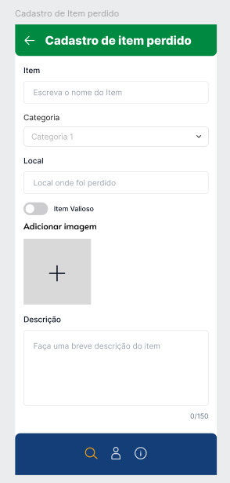
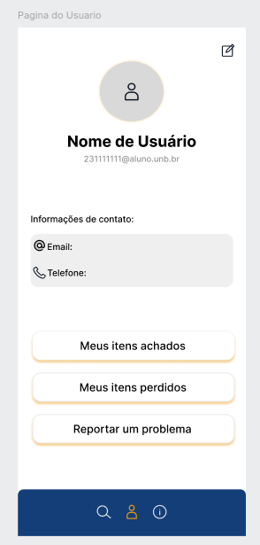
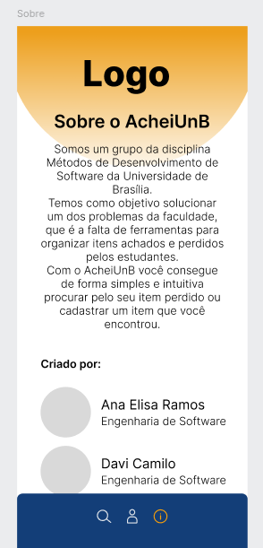

Implementação inicial do Figma: [Aqui](https://www.figma.com/design/balBSne5eGu1mDpKqEW7ey/Tailwind-UI-Components-for-Figma-%7C-TailGrids-(Community)?node-id=510-207&node-type=canvas&t=bOeHKWqF0iphWZJc-0)

# O que foi feito até agora?

Foram definidas as telas que o site terá e teve início a prototipação delas no Figma. Optou-se por cada um ficar responsável pela criação de metade das telas, sendo as primeiras feitas em conjunto para que houvesse uma melhor ambientação ao Figma e cada um se ajudasse compartilhando dicas e ideias.

## Implementação inicial de algumas telas

Aqui estão algumas telas que já foram feitas, lembrando ainda que essa não é a versão final. Algumas coisas podem ser alteradas.

            

# O que falta?

Pretendemos fazer uma versão do protótipo tanto para mobile quanto para desktop. O protótipo para mobile tem sido o foco, tendo em vista que grande parte do público alvo do site acessará principalmente por meio de celular. Também pretendemos adicionar reatividade no protótipo, para que fique o mais fiél possível ao site que iremos implementar, em que sejá possível navegar entre as páginas e clicar em botões.
As telas que faltam são:
- Tela específica do item
- Tela de meus itens
- Tela de chat
